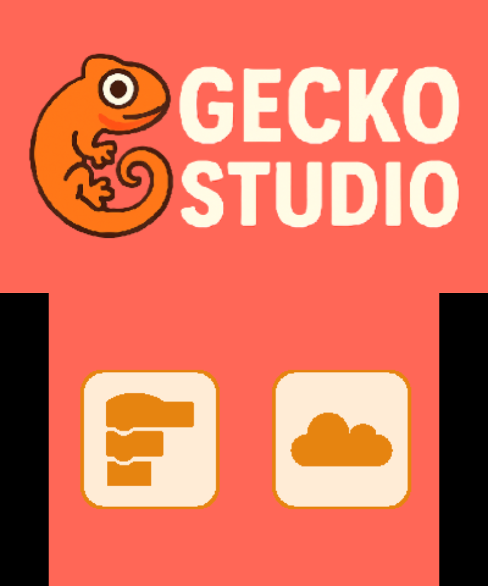
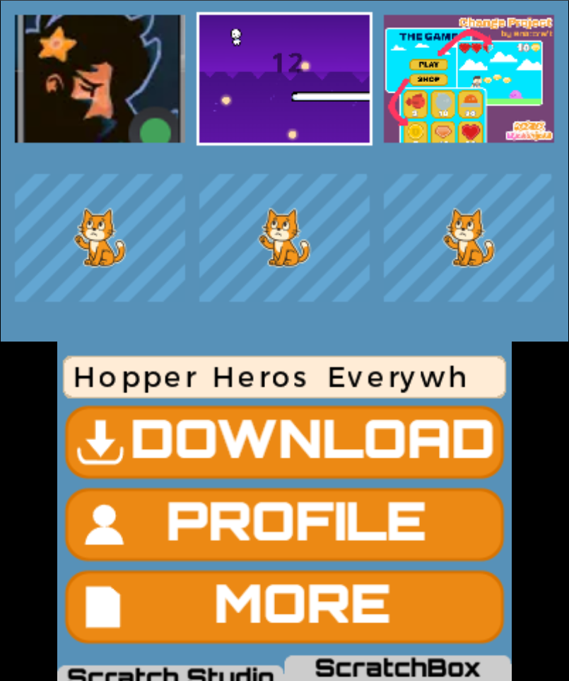

# Cat-Engine
A work in progress Scratch viewer/editor and downloader.

Not everything is working yet!

Uses the [Scratch](https://scratch.mit.edu/) and [ScratchBox](https://scratchbox.grady.link/) API to list projects

## License

This project is licensed under the MIT License.

### Third-Party Libraries

This project uses the following third-party libraries:

- [libctru](https://github.com/devkitPro/libctru) — zlib License
- [citro2d](https://github.com/devkitPro/citro2d) — zlib License
- [citro3d](https://github.com/devkitPro/citro3d) — zlib License
- [curl](https://curl.se/libcurl/) — curl License (MIT-like)
- [nlohmann/json](https://github.com/nlohmann/json) — MIT License
- [stb_image](https://github.com/nothings/stb) — Public Domain / MIT

The complete license texts can be found in the license folder.
